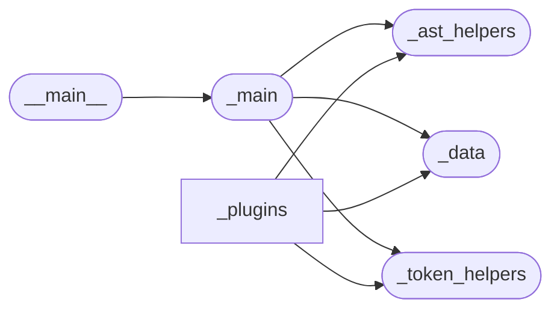

# Code Overview

[_Documentation generated by Documatic_](https://www.documatic.com)

<!---Documatic-section-Codebase Structure Python-start--->
## Codebase Structure Python

The codebase has a single-depth folder structure,
                with 13 code files in total.

<!---Documatic-block-system_architecture-start--->

<!---Documatic-block-system_architecture-end--->

# #
<!---Documatic-section-Codebase Structure Python-end--->

<!---Documatic-section-Important Functions-start--->
## Important Functions

<!---Documatic-block-important_funcs-start--->
<!---Documatic-block-most_used_funcs-start--->
### Most Utilised Functions

* add_trailing_comma._token_helpers.fix_brace (7 times)
* add_trailing_comma._ast_helpers.ast_to_offset (6 times)
* add_trailing_comma._data.register (6 times)
* add_trailing_comma._token_helpers.find_simple (4 times)
* add_trailing_comma._token_helpers.find_call (4 times)
* add_trailing_comma._main.main (1 times)
* add_trailing_comma._ast_helpers.ast_parse (1 times)
* add_trailing_comma._data.visit (1 times)
<!---Documatic-block-most_used_funcs-end--->

<!---Documatic-block-end_user_funcs-start--->
### End User Exposed Functions

* add_trailing_comma._main.main
<!---Documatic-block-end_user_funcs-end--->
<!---Documatic-block-important_funcs-end--->

# #
<!---Documatic-section-Important Functions-end--->

<!---Documatic-section-Class Hierarchy-start--->
## Class Hierarchy

<!---Documatic-block-NamedTuple-start--->

	
<code>NamedTuple</code> (Click to Expand!)

* add_trailing_comma._data.State
* add_trailing_comma._token_helpers.Fix

<!---Documatic-block-NamedTuple-end--->

<!---Documatic-block-Protocol-start--->

	
<code>Protocol</code> (Click to Expand!)

* add_trailing_comma._data.ASTCallbackMapping

<!---Documatic-block-Protocol-end--->

# #
<!---Documatic-section-Class Hierarchy-end--->

[_Documentation generated by Documatic_](https://www.documatic.com)