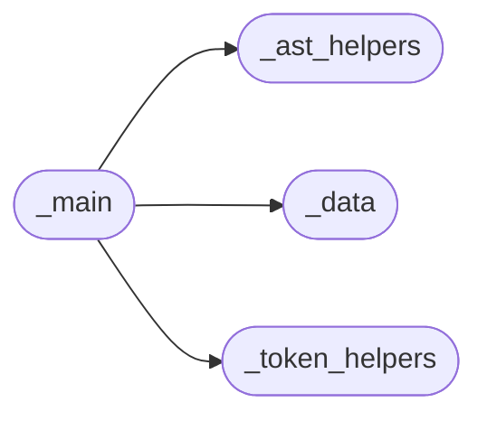

# Add Trailing Comma Main

[_Documentation generated by Documatic_](https://www.documatic.com)

<!---Documatic-section-Codebase Structure-start--->
## Codebase Structure

<!---Documatic-block-system_architecture-start--->

<!---Documatic-block-system_architecture-end--->

# #
<!---Documatic-section-Codebase Structure-end--->

<!---Documatic-section-add_trailing_comma._main.main-start--->
## add_trailing_comma._main.main

<!---Documatic-section-main-start--->
<!---Documatic-block-add_trailing_comma._main.main-start--->
<details>
	<summary><code>add_trailing_comma._main.main</code> code snippet</summary>

```python
def main(argv: Sequence[str] | None=None) -> int:
    parser = argparse.ArgumentParser()
    parser.add_argument('filenames', nargs='*')
    parser.add_argument('--exit-zero-even-if-changed', action='store_true')
    parser.add_argument('--py35-plus', action='store_const', dest='min_version', const=(3, 5), default=(2, 7))
    parser.add_argument('--py36-plus', action='store_const', dest='min_version', const=(3, 6))
    args = parser.parse_args(argv)
    ret = 0
    for filename in args.filenames:
        ret |= fix_file(filename, args)
    return ret
```
</details>
<!---Documatic-block-add_trailing_comma._main.main-end--->
<!---Documatic-section-main-end--->

# #
<!---Documatic-section-add_trailing_comma._main.main-end--->

[_Documentation generated by Documatic_](https://www.documatic.com)