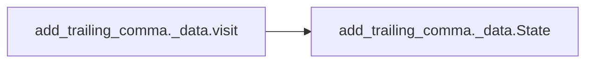

# Add Trailing Comma Data

[_Documentation generated by Documatic_](https://www.documatic.com)

<!---Documatic-section-Codebase Structure-start--->
## Codebase Structure

<!---Documatic-block-system_architecture-start--->
```mermaid
None
```
<!---Documatic-block-system_architecture-end--->

# #
<!---Documatic-section-Codebase Structure-end--->

<!---Documatic-section-add_trailing_comma._data.register-start--->
## add_trailing_comma._data.register

<!---Documatic-section-register-start--->
<!---Documatic-block-add_trailing_comma._data.register-start--->
<details>
	<summary><code>add_trailing_comma._data.register</code> code snippet</summary>

```python
def register(tp: type[AST_T]) -> Callable[[ASTFunc[AST_T]], ASTFunc[AST_T]]:

    def register_decorator(func: ASTFunc[AST_T]) -> ASTFunc[AST_T]:
        FUNCS[tp].append(func)
        return func
    return register_decorator
```
</details>
<!---Documatic-block-add_trailing_comma._data.register-end--->
<!---Documatic-section-register-end--->

# #
<!---Documatic-section-add_trailing_comma._data.register-end--->

<!---Documatic-section-add_trailing_comma._data.visit-start--->
## add_trailing_comma._data.visit

<!---Documatic-section-visit-start--->


### Object Calls

* add_trailing_comma._data.State

<!---Documatic-block-add_trailing_comma._data.visit-start--->
<details>
	<summary><code>add_trailing_comma._data.visit</code> code snippet</summary>

```python
def visit(funcs: ASTCallbackMapping, tree: ast.AST, version: Version) -> dict[Offset, list[TokenFunc]]:
    nodes = [(tree, State(min_version=version))]
    ret = collections.defaultdict(list)
    while nodes:
        (node, state) = nodes.pop()
        tp = type(node)
        for ast_func in funcs[tp]:
            for (offset, token_func) in ast_func(state, node):
                ret[offset].append(token_func)
        if tp is ast.FormattedValue:
            state = state._replace(in_fstring=True)
        for name in reversed(node._fields):
            value = getattr(node, name)
            if isinstance(value, ast.AST):
                nodes.append((value, state))
            elif isinstance(value, list):
                for value in reversed(value):
                    if isinstance(value, ast.AST):
                        nodes.append((value, state))
    return ret
```
</details>
<!---Documatic-block-add_trailing_comma._data.visit-end--->
<!---Documatic-section-visit-end--->

# #
<!---Documatic-section-add_trailing_comma._data.visit-end--->

<!---Documatic-section-add_trailing_comma._data.State-start--->
## add_trailing_comma._data.State

<!---Documatic-section-State-start--->
<!---Documatic-block-add_trailing_comma._data.State-start--->
<details>
	<summary><code>add_trailing_comma._data.State</code> code snippet</summary>

```python
class State(NamedTuple):
    min_version: Version
    in_fstring: bool = False
```
</details>
<!---Documatic-block-add_trailing_comma._data.State-end--->
<!---Documatic-section-State-end--->

# #
<!---Documatic-section-add_trailing_comma._data.State-end--->

[_Documentation generated by Documatic_](https://www.documatic.com)