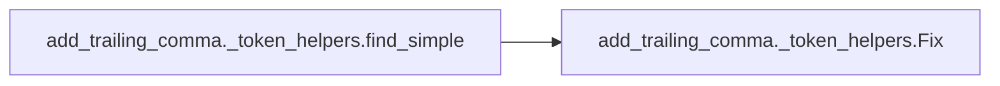
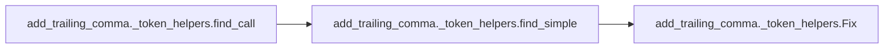

# Add Trailing Comma Token Helpers

[_Documentation generated by Documatic_](https://www.documatic.com)

<!---Documatic-section-Codebase Structure-start--->
## Codebase Structure

<!---Documatic-block-system_architecture-start--->
```mermaid
None
```
<!---Documatic-block-system_architecture-end--->

# #
<!---Documatic-section-Codebase Structure-end--->

<!---Documatic-section-add_trailing_comma._token_helpers.fix_brace-start--->
## add_trailing_comma._token_helpers.fix_brace

<!---Documatic-section-fix_brace-start--->
<!---Documatic-block-add_trailing_comma._token_helpers.fix_brace-start--->
<details>
	<summary><code>add_trailing_comma._token_helpers.fix_brace</code> code snippet</summary>

```python
def fix_brace(tokens: list[Token], fix_data: Fix | None, add_comma: bool, remove_comma: bool) -> None:
    if fix_data is None:
        return
    (first_brace, last_brace) = fix_data.braces
    hug_open = tokens[first_brace + 1].name not in NON_CODING_TOKENS
    hug_close = tokens[last_brace - 1].name not in NON_CODING_TOKENS
    if not fix_data.multi_arg and tokens[first_brace + 1].src in START_BRACES and (tokens[last_brace - 1].src in END_BRACES) or first_brace + 2 == last_brace or fix_data.remove_comma:
        hug_open = hug_close = False
    if hug_open:
        new_indent = fix_data.initial_indent + 4
        tokens[first_brace + 1:first_brace + 1] = [Token('NL', '\n'), Token(UNIMPORTANT_WS, ' ' * new_indent)]
        last_brace += 2
        min_indent = None
        indents = []
        insert_indents = []
        for i in range(first_brace + 3, last_brace):
            if tokens[i - 1].name == 'NL' and tokens[i].name != 'NL':
                if tokens[i].name != UNIMPORTANT_WS:
                    min_indent = 0
                    insert_indents.append(i)
                else:
                    if min_indent is None:
                        min_indent = len(tokens[i].src)
                    elif len(tokens[i].src) < min_indent:
                        min_indent = len(tokens[i].src)
                    indents.append(i)
        if indents:
            assert min_indent is not None
            for i in indents:
                oldlen = len(tokens[i].src)
                newlen = oldlen - min_indent + new_indent
                tokens[i] = tokens[i]._replace(src=' ' * newlen)
        for i in reversed(insert_indents):
            tokens.insert(i, Token(UNIMPORTANT_WS, ' ' * new_indent))
            last_brace += 1
    if hug_close:
        tokens[last_brace:last_brace] = [Token('NL', '\n'), Token(UNIMPORTANT_WS, ' ' * fix_data.initial_indent)]
        last_brace += 2
    i = last_brace - 1
    while tokens[i].name in NON_CODING_TOKENS:
        i -= 1
    if add_comma and tokens[i].src != ',' and (i + 1 != last_brace):
        tokens.insert(i + 1, Token('OP', ','))
    back_1 = tokens[last_brace - 1]
    back_2 = tokens[last_brace - 2]
    if back_1.name == UNIMPORTANT_WS and back_2.name == 'NL' and (len(back_1.src) != fix_data.initial_indent):
        indent = fix_data.initial_indent * ' '
        tokens[last_brace - 1] = back_1._replace(src=indent)
    if fix_data.remove_comma:
        start = last_brace
        if tokens[start - 1].name == UNIMPORTANT_WS:
            start -= 1
        if remove_comma and tokens[start - 1].src == ',':
            start -= 1
        del tokens[start:last_brace]
```
</details>
<!---Documatic-block-add_trailing_comma._token_helpers.fix_brace-end--->
<!---Documatic-section-fix_brace-end--->

# #
<!---Documatic-section-add_trailing_comma._token_helpers.fix_brace-end--->

<!---Documatic-section-add_trailing_comma._token_helpers.find_simple-start--->
## add_trailing_comma._token_helpers.find_simple

<!---Documatic-section-find_simple-start--->


### Object Calls

* add_trailing_comma._token_helpers.Fix

<!---Documatic-block-add_trailing_comma._token_helpers.find_simple-start--->
<details>
	<summary><code>add_trailing_comma._token_helpers.find_simple</code> code snippet</summary>

```python
def find_simple(first_brace: int, tokens: list[Token]) -> Fix | None:
    brace_stack = [first_brace]
    multi_arg = False
    for i in range(first_brace + 1, len(tokens)):
        token = tokens[i]
        if token.src in START_BRACES:
            brace_stack.append(i)
        elif token.src in END_BRACES:
            brace_stack.pop()
        if len(brace_stack) == 1 and token.src == ',':
            multi_arg = True
        if not brace_stack:
            break
    else:
        raise AssertionError('Past end?')
    last_brace = i
    if tokens[first_brace].line == tokens[last_brace].line and (tokens[last_brace - 1].name == UNIMPORTANT_WS or tokens[last_brace - 1].src == ','):
        remove_comma = True
    elif tokens[first_brace].line == tokens[last_brace].line:
        return None
    else:
        remove_comma = False
    i = first_brace
    while i >= 0 and tokens[i].name not in NEWLINES:
        i -= 1
    if i >= 0 and tokens[i + 1].name in INDENT_TOKENS:
        initial_indent = len(tokens[i + 1].src)
    else:
        initial_indent = 0
    return Fix((first_brace, last_brace), multi_arg=multi_arg, remove_comma=remove_comma, initial_indent=initial_indent)
```
</details>
<!---Documatic-block-add_trailing_comma._token_helpers.find_simple-end--->
<!---Documatic-section-find_simple-end--->

# #
<!---Documatic-section-add_trailing_comma._token_helpers.find_simple-end--->

<!---Documatic-section-add_trailing_comma._token_helpers.find_call-start--->
## add_trailing_comma._token_helpers.find_call

<!---Documatic-section-find_call-start--->


### Object Calls

* add_trailing_comma._token_helpers.find_simple

<!---Documatic-block-add_trailing_comma._token_helpers.find_call-start--->
<details>
	<summary><code>add_trailing_comma._token_helpers.find_call</code> code snippet</summary>

```python
def find_call(arg_offsets: set[Offset], i: int, tokens: list[Token]) -> Fix | None:
    first_brace = None
    paren_stack = []
    for i in range(i, len(tokens)):
        token = tokens[i]
        if token.src == '(':
            paren_stack.append(i)
        elif token.src == ')' and paren_stack:
            paren_stack.pop()
        if (token.line, token.utf8_byte_offset) in arg_offsets:
            first_brace = paren_stack[0]
            break
    else:
        raise AssertionError('Past end?')
    return find_simple(first_brace, tokens)
```
</details>
<!---Documatic-block-add_trailing_comma._token_helpers.find_call-end--->
<!---Documatic-section-find_call-end--->

# #
<!---Documatic-section-add_trailing_comma._token_helpers.find_call-end--->

<!---Documatic-section-add_trailing_comma._token_helpers.Fix-start--->
## add_trailing_comma._token_helpers.Fix

<!---Documatic-section-Fix-start--->
<!---Documatic-block-add_trailing_comma._token_helpers.Fix-start--->
<details>
	<summary><code>add_trailing_comma._token_helpers.Fix</code> code snippet</summary>

```python
class Fix(NamedTuple):
    braces: tuple[int, int]
    multi_arg: bool
    remove_comma: bool
    initial_indent: int
```
</details>
<!---Documatic-block-add_trailing_comma._token_helpers.Fix-end--->
<!---Documatic-section-Fix-end--->

# #
<!---Documatic-section-add_trailing_comma._token_helpers.Fix-end--->

[_Documentation generated by Documatic_](https://www.documatic.com)